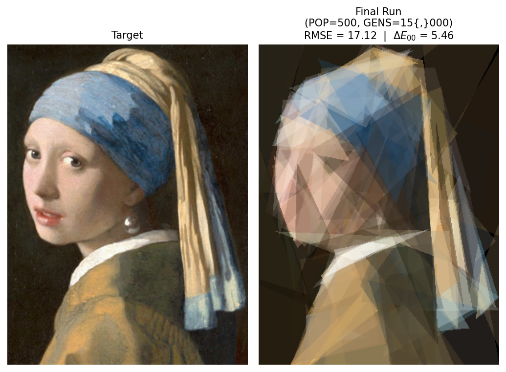

# Genetic Algorithm Image Reconstruction — Vermeer's *Girl with a Pearl Earring*


> Evolutionary reconstruction of a 300×400 painting using exactly 100 semi-transparent triangles, optimised by a Genetic Algorithm with OFAT hyperparameter tuning, random search refinement, and a perceptual CIEDE2000 fitness challenge.

---

## Best Result

<p align="center">
  
</p>

*Best reconstruction: **RMSE = 17.12**, ΔE₀₀ = 5.46 — long-budget run (POP=500, GENS=15 000, ~28.6 h wall-clock). Budget-matched cross-evaluation in [§Results](#results-summary).*

---

## Overview

This project reconstructs Vermeer's *Girl with a Pearl Earring* (300×400 px) by evolving a population of candidate images, each represented as an ordered list of 100 semi-transparent RGBA triangles rendered via Porter-Duff alpha compositing. The GA minimises pixel-wise RMSE between the rendered phenotype and the target.

The experimental pipeline is fully systematic. Six One-Factor-At-A-Time (OFAT) phases isolated the contribution of each GA component — mutation operator, crossover operator, probability settings, triangle size, alpha window, and diversity mechanisms — with 15 independent runs and non-parametric statistical tests at each step. A joint random search over 8 hyperparameters then probed interactions the greedy OFAT protocol cannot expose, and the top candidates were re-validated with 15 runs to obtain a statistically robust final configuration.

**Challenge 1** replaces the RGB-RMSE fitness with CIEDE2000, a perceptually uniform colour-difference metric computed in CIE Lab space. A budget-matched comparison (POP=200, GENS=5 000, single seed, identical hyperparameters) shows that the RMSE-tuned GA scores RMSE=19.63 / ΔE=6.09 while the CIEDE2000-tuned GA scores RMSE=23.83 / ΔE=6.20 — the RMSE-tuned variant wins on both metrics at this short budget, with the perceptual advantage of CIEDE2000 expected to emerge only at larger budgets where triangle geometry is already converged.

---

## Repository Structure

```
.
├── solution.py             # Individual + Triangle classes; rendering (Porter-Duff);
│                           # RMSE and CIEDE2000 fitness; sRGB→Lab pipeline
├── operators.py            # All GA operators: 3 selection, 5 crossover, 5 mutation
├── ga.py                   # Generational GA loop: elitism, adaptive mutation (1/5 rule),
│                           # diversity injection, restricted mating support
├── _run_experiment.py      # Unified phase runner with checkpoint/restart;
│                           # defines all PHASES, WINNERS, FINAL_SETUP
├── utils.py                # Plotting helpers, compare_all_configs, load_experiment_artifacts
├── main.ipynb              # End-to-end analytical notebook (loads checkpoints, no GA runs)
├── report.tex              # LaTeX report (Overleaf-ready; all figures in figures/)
├── requirements.txt        # Python dependencies
│
├── run_artifacts/          # Per-run checkpoints (JSON), convergence curves (.npy),
│                           # best-individual PNGs; all phases write here
├── figures/                # All figures used in the report
│   ├── final_run_best.png           # Target + final run (RMSE=17.12)
│   ├── rmse_vs_ciede2000.png        # Budget-matched cross-eval side-by-side
│   ├── mutation_comparison.png      # Sec 5.1
│   ├── crossover_comparison.png     # Sec 5.2
│   ├── probabilities_comparison.png # Sec 5.3
│   ├── triangle_comparison_*.png    # Sec 5.4
│   ├── alpha_comparison.png         # Sec 5.5
│   ├── diversity_comparison.png     # Sec 5.6
│   └── top3_graphs.png              # Sec 5.7
│
└── run_logs/
        └── run_log_*.txt    # Stdout logs from _run_experiment.py per phase
```

---

## Methodology

### Representation

Each **Individual** is an ordered list of 100 **Triangles**. Each triangle is encoded as 10 real-valued genes, all normalised to [0, 1]:

```
t = (x₁, y₁, x₂, y₂, x₃, y₃, r, g, b, α)
```

Vertices are decoded to pixel coordinates at render time (`x × 299`, `y × 399`); colour channels scale to [0, 255]. The **list order is the z-order**: later triangles paint over earlier ones via Porter-Duff `alpha_composite`, so triangle ordering is part of the chromosome semantics.

Three domain constraints are enforced in `Triangle.__init__` on every construction:
- **`max_triangle_size`**: bounding-box span per axis capped; oversized triangles contracted toward their centroid.
- **Alpha window `[α_min, α_max]`**: prevents invisible (α≈0) and fully opaque (α≈1) triangles.
- **Positive area**: degenerate triangles perturbed until pixel area > 0 (max 12 retries; deterministic fallback).

### Genetic Operators

| Type | Operator | Key detail |
|------|----------|------------|
| **Selection** | Tournament (`k=2..5`) | k drawn with replacement; returns copy with cached `_fitness` |
| | Fitness Sharing | Crowding penalty via pairwise genotype distance; σ=0.22, λ=0.18 |
| | Restricted Mating | Parent 2 constrained to distance window [d_min, d_max] from parent 1 |
| **Crossover** | Uniform | Per-gene ∈ {parent 1, parent 2} independently; p=0.5; complementary offspring |
| | K-Point | K ~ U(3, 7) cut points; preserves contiguous triangle blocks |
| | Reduced Surrogate | Cuts only at positions where parents differ |
| | Shuffle | Permute → single-point → inverse-permute; eliminates positional bias |
| | Adaptive Schedule | Uniform (0–50%) → K-Point (50–85%) → Reduced Surrogate (85–100%) |
| **Mutation** | VCF | Per-triangle: random subset of {Vertex, Color, Full, Order} applied jointly |
| | Full Replacement | Replace entire triangle with new random one; most destructive |
| | Gaussian Gene | Per-gene N(0, σ=0.05), uniform genome exploration |
| | Color Creep | Perturbs only RGBA channels (genes 6–9); geometry frozen |
| | Adaptive Schedule | Full (0–40%) → Gaussian (40–85%) → Color Creep (85–100%) |

### EA Enhancements

**Elitism**: the best individual is copied unchanged into the next generation; its cached `_fitness` is carried across so no re-render is needed.

**Rechenberg's 1/5 rule** (Rechenberg, 1973): a sliding window of `w=10` generations tracks offspring success rate. If rate > 0.2, `mut_prob ×= 1.1`; if < 0.2, `mut_prob ×= 0.9`. Clipped to [0.001, 0.5].

**Diversity injection**: when population fitness std-dev drops below `0.5 × initial_std`, the worst 20% of individuals are replaced with new random ones. Elites are never replaced.

**Restricted mating**: parent 2 is sampled from a pool of 10 candidates filtered to distance window [0.010, 0.348] from parent 1. When no candidate satisfies the window, the one closest to the midpoint distance is chosen as a graceful fallback.

### Experimental Protocol

| Phase | Configs | Runs | POP | GENS | Purpose |
|-------|---------|------|-----|------|---------|
| Mutation | 5 operators | 15 each | 100 | 500 | Operator selection (p_c = 0) |
| Crossover | 5 operators | 15 each | 100 | 500 | Operator selection (p_m = 0) |
| Probabilities | 3×3 grid | 15 each | 100 | 500 | p_m × p_c sweep |
| Size | 4 values | 15 each | 100 | 500 | max_triangle_size sweep |
| Alpha | 5 windows | 15 each | 100 | 500 | Alpha window sweep |
| Diversity | 7 configs | 15 each | 100 | 500 | Diversity mechanism comparison |
| Random search | 12 samples | 5 each | 100 | 500 | Joint 8-dim hyperparameter search |
| validate_top3 | 3 configs | 15 each | 100 | 500 | Statistical validation of top candidates |
| final_run | 1 config | 1 | 500 | 15 000 | Best achievable image |
| ciede2000_short | 1 config | 1 | 200 | 5 000 | Challenge 1 (CIEDE2000 fitness) |

**Statistical tests** — primary (OFAT independent-treatment design): Kruskal-Wallis (omnibus) + Mann-Whitney U with Bonferroni correction (pairwise). Secondary (shared-seed pairing, `random.seed(run × SEED)`): Friedman χ² + Wilcoxon signed-rank. Both analyses agreed in every phase (Friedman p < 10⁻⁸ throughout).

### Challenge 1: CIEDE2000

The pixel-wise RMSE penalises all channel deviations equally, but sRGB is perceptually non-uniform. CIEDE2000 (Sharma, Wu & Dalal, 2005) corrects the residual non-uniformities of CIE Lab, particularly in the blue region — directly relevant for Vermeer's ultramarine turban.

**Pipeline**: rendered image (sRGB, [0, 255]) → linear RGB (inverse-gamma, IEC 61966-2-1) → CIE XYZ (D65 white point matrix) → CIE Lab → per-pixel ΔE₀₀ → mean over 120 000 pixels. Fully vectorised; no Python-level loops.

---

## Results Summary

### OFAT + random search phases (15 runs, POP=100, GENS=500)

| Phase | Best configuration | Mean RMSE | Std | Runs |
|---|---|---:|---:|---:|
| Mutation | AdaptiveMut | 41.753 | 1.169 | 15 |
| Crossover | Uniform | 51.056 | 1.324 | 15 |
| Probabilities | p_m=0.01, p_c=0.95 | 31.484 | 0.754 | 15 |
| Triangle size | s_max=1.0 (unconstrained) | 31.484 | 0.754 | 15 |
| Alpha window | [0.10, 0.40] | 30.181 | 0.542 | 15 |
| Diversity | Restricted mating | 27.591 | 0.563 | 15 |
| validate_top3 | sample_11 | 26.556 | 0.535 | 15 |

*All Kruskal-Wallis tests: p < 0.0001. Full tables and convergence curves in [main.ipynb](main.ipynb) and in the appendix of [report.tex](report.tex).*

### Long-budget runs (single seed)

| Run | Config | POP | GENS | RMSE | ΔE₀₀ |
|---|---|---:|---:|---:|---:|
| `final_run_short` | sample_11, RMSE fitness | 200 | 5 000 | **19.63** | 6.09 |
| `final_run` | sample_11, RMSE fitness | 500 | 15 000 | **17.12** | 5.46 |
| `ciede2000_short` | sample_11, CIEDE2000 fitness | 200 | 5 000 | 23.83 | **6.20** |

### Challenge 1 cross-evaluation (budget-matched, POP=200, GENS=5 000)

| Winner | RMSE | ΔE₀₀ |
|---|---:|---:|
| RMSE-optimised (`final_run_short`) | **19.63** | 6.09 |
| CIEDE2000-optimised (`ciede2000_short`) | 23.83 | **6.20** |

At this short budget the RMSE-tuned GA wins on both metrics. The perceptual advantage of CIEDE2000 is expected to emerge at larger budgets where geometry is already converged and the remaining budget is spent on colour refinement.

---

## How to Reproduce

### Installation

```bash
git clone https://github.com/barbara-sousa-franco/cifo_project
cd cifo_project
pip install -r requirements.txt
```

**Dependencies**: `numpy>=2.0`, `pandas>=2.0`, `scipy>=1.11`, `pillow>=10.0`, `matplotlib>=3.8`, `jupyter>=1.0`, `nbconvert>=7.0`.

### Smoke test (< 5 seconds)

```bash
python _smoke_test.py
# Expected: [OK] Both smoke tests passed.
```

### Run a specific experiment phase

```bash
# Single phase
python _run_experiment.py mutation
python _run_experiment.py diversity

# Multiple phases in sequence
python _run_experiment.py mutation crossover probabilities size alpha diversity

# Random search + top-3 validation
python _run_experiment.py random_search validate_top3

# Long-budget final runs
python _run_experiment.py final_run        # ~28 h, POP=500 GENS=15000
python _run_experiment.py ciede2000_short  # ~14 h, POP=200 GENS=5000, CIEDE2000 fitness

# Filter configs within a phase
python _run_experiment.py mutation --only AdaptiveMut Gaussian
python _run_experiment.py probabilities --skip mut0.15_xo0.85
```

Checkpoints are written to `run_artifacts/` after every individual run. Interrupted phases resume automatically on re-launch.

### Statistical analysis

```bash
python _stats_tests.py mutation crossover probabilities size alpha diversity
```

Outputs both the primary unpaired analysis (OFAT) and the secondary paired analysis (shared seeds) for each phase.

### Run the full notebook

```bash
# Interactive
jupyter notebook main.ipynb

# Headless — purely analytical, no GA runs, completes in < 1 minute
jupyter nbconvert --to notebook --execute main.ipynb --output main_executed.ipynb
```

### Expected runtimes (consumer laptop, Windows 11, Python 3.11)

| Phase | Approx. time |
|---|---|
| Each OFAT phase (15 runs × 500 gens × POP=100) | ~3 h |
| Random search (12 × 5 runs) | ~6 h |
| validate_top3 (3 × 15 runs) | ~3 h |
| final_run (POP=500, GENS=15 000) | ~28.6 h |
| ciede2000_short (POP=200, GENS=5 000) | ~14 h |
| Notebook (loads checkpoints only) | < 1 min |

---

## Key Design Decisions

**Why Uniform crossover beat Adaptive XO** (mean 51.06 vs 51.07, p=0.84): the Adaptive XO schedule ends with Reduced Surrogate, which is neutral once Uniform has already explored the genome. On a continuous real-valued representation, cutting only at differing positions barely restricts the cut, so the schedule adds overhead with no benefit.

**Why alpha window [0.10, 0.40] dominated**: translucent triangles favour additive layering — a region's colour emerges from several overlapping primitives rather than one opaque one, effectively raising palette resolution without increasing chromosome size. Narrowing toward higher alpha (e.g., [0.50, 0.70]) destroys this layering effect.

**Why Restricted Mating was the only diversity mechanism with real gain** (−2.59 RMSE vs baseline, p<0.0001): the other three mechanisms (adaptive mutation rate, diversity injection, fitness sharing) act on the population as a whole, which disturbs a population already converging usefully. Restricted mating acts at the pairing level, refusing clones and disruptively distant parents without interfering with the convergence trajectory.

**Why tournament_size=5 did not appear in OFAT**: a dimension held constant in OFAT is invisible by construction. The random search found tournament_size=5 only by perturbing it jointly with 7 other hyperparameters, yielding ~1 RMSE improvement — the single largest gain not exposed by the greedy protocol.

**Why CIEDE2000 is methodologically correct but computationally constrained**: sRGB is perceptually non-uniform; the same numerical RGB distance can correspond to very different perceived colour differences. CIEDE2000 corrects this, especially in the blue and grey regions (Vermeer's turban). However, the formula requires ~13 trigonometric operations per pixel vs ~3 for RMSE, making it ~25× slower per generation. A full POP=500/GENS=15 000 CIEDE2000 run was estimated at ~4 days — beyond the project deadline, and listed as future work.

---

## References

- Sharma, G., Wu, W. & Dalal, E. (2005). *The CIEDE2000 color-difference formula.* Color Research & Application, 30(1), 21–30.
- Goldberg, D. E. (1989). *Genetic Algorithms in Search, Optimization and Machine Learning.* Addison-Wesley.
- Eshelman, L. J. & Schaffer, J. D. (1991). *Preventing premature convergence in genetic algorithms by preventing incest.* ICGA 1991, 115–122.
- Rechenberg, I. (1973). *Evolutionsstrategie.* Frommann-Holzboog.
- Eiben, A. E. & Smith, J. E. (2015). *Introduction to Evolutionary Computing* (2nd ed.). Springer.

---

## Authors

**Group 36 — Divergence** · MSc in Data Science & Advanced Analytics · NOVA IMS · 2025/2026

| Name | Student number |
|---|---|
| Bárbara Franco | 20250388 |
| Catarina Mendinhas | 20250422 |
| Maria Miguel Fonseca | 20250380 |
| Tiago Antunes | 20250357 |
